# Sistema de Gestión de Inventario Industrial - Naromi Studio

Práctica Profesional 4 
Sistema desarrollado en Django que implementa un sistema de gestión de inventario industrial, incluyendo gestión de usuarios, inventario de insumos y pedidos.

## Características

- **Gestión de Usuarios**: Sistema de autenticación con roles (Administrador y Empleado)
- **Inventario de Insumos**: Control de stock con alertas de stock mínimo
- **Gestión de Pedidos**: Seguimiento de pedidos desde ingreso hasta completado
- **Interfaz Administrativa**: Panel de administración de Django con funcionalidades personalizadas
- **Formularios con Bootstrap 5**: Interfaz moderna usando django-crispy-forms

## Requisitos del Sistema

- Python 3.8 o superior
- pip (gestor de paquetes de Python)

## Instalación y Configuración

### 1. Clonar el Repositorio

```bash
git clone <url-del-repositorio>
cd naromi
```

### 2. Crear un Entorno Virtual (Recomendado)

```bash
# En Windows
python -m venv venv
venv\Scripts\activate

# En macOS/Linux
python3 -m venv venv
source venv/bin/activate
```

### 3. Instalar Dependencias

```bash
pip install -r requirements.txt
```

### 4. Configurar la Base de Datos

```bash
# Aplicar migraciones
python manage.py migrate

# Crear un superusuario (opcional)
python manage.py createsuperuser
```

### 5. Ejecutar el Servidor de Desarrollo

```bash
python manage.py runserver
```

El servidor estará disponible en: `http://127.0.0.1:8000/`

## Uso del Sistema

### Acceso Principal

- **Página Principal**: `http://127.0.0.1:8000/`
- **Panel de Administración**: `http://127.0.0.1:8000/admin/`

### Funcionalidades Disponibles

#### 1. Gestión de Usuarios
- Crear usuarios con roles específicos (Administrador/Empleado)
- Autenticación y autorización
- Panel de administración personalizado

#### 2. Gestión de Insumos
- Crear y editar insumos con SKU único
- Control de stock actual y mínimo
- Alertas automáticas cuando el stock está por debajo del mínimo
- Búsqueda y filtrado por color, talla, etc.

#### 3. Gestión de Pedidos
- Crear pedidos con información del cliente
- Seguimiento de estados: Ingresado → Presupuestado → Aprobado → Orden de Trabajo → Completado
- Gestión de insumos por pedido
- Validación automática de stock al cambiar a "Orden de Trabajo"

### Estados de Pedidos

1. **Ingresado**: Pedido recién creado
2. **Presupuestado**: Presupuesto generado
3. **Aprobado**: Pedido aprobado por el cliente
4. **Orden de Trabajo**: En proceso de producción
5. **Completado**: Pedido finalizado
6. **Cancelado**: Pedido cancelado

## Estructura del Proyecto

```
naromi/
├── gestion/                 # Configuración principal de Django
│   ├── __init__.py
│   ├── settings.py         # Configuración del proyecto
│   ├── urls.py            # URLs principales
│   ├── wsgi.py            # Configuración WSGI
│   └── asgi.py            # Configuración ASGI
├── gestion_general/        # Aplicación principal
│   ├── models.py          # Modelos de datos
│   ├── views.py           # Vistas
│   ├── admin.py           # Configuración del admin
│   ├── migrations/        # Migraciones de base de datos
│   └── tests.py           # Tests unitarios
├── manage.py              # Script de gestión de Django
├── requirements.txt       # Dependencias del proyecto
└── README.md             # Este archivo
```

## Modelos de Datos

### Usuario
- Extiende el modelo de usuario de Django
- Roles: Administrador y Empleado
- Campos adicionales para gestión de roles

### Insumo
- SKU único para identificación
- Información básica (nombre, descripción, color, talla)
- Control de stock (actual y mínimo)
- Precio unitario

### Pedido
- Información del cliente
- Estado del pedido
- Usuario que creó el pedido
- Total del pedido

### PedidoInsumo
- Relación entre pedidos e insumos
- Cantidad requerida por insumo

## Tecnologías Utilizadas

- **Django 5.2.6**: Framework web principal
- **SQLite**: Base de datos (desarrollo)
- **django-crispy-forms**: Formularios con Bootstrap 5
- **Gunicorn**: Servidor WSGI para producción
- **WhiteNoise**: Servir archivos estáticos

## Comandos Útiles

```bash
# Crear migraciones después de cambios en modelos
python manage.py makemigrations

# Aplicar migraciones
python manage.py migrate

# Crear superusuario
python manage.py createsuperuser

# Configurar permisos de usuarios
python manage.py setup_permissions

# Ejecutar tests
python manage.py test

# Recopilar archivos estáticos (producción)
python manage.py collectstatic
```

## Desarrollo

### Agregar Nuevas Funcionalidades

1. Modificar modelos en `gestion_general/models.py`
2. Crear migraciones: `python manage.py makemigrations`
3. Aplicar migraciones: `python manage.py migrate`
4. Actualizar vistas en `gestion_general/views.py`
5. Configurar URLs en `gestion/urls.py`

### Personalizar el Admin

Las configuraciones del panel de administración se encuentran en `gestion_general/admin.py` y incluyen:
- Personalización de listas de visualización
- Filtros y búsquedas
- Validaciones personalizadas
- Inlines para relaciones

## Solución de Problemas

## Datos de Prueba

### Cargar Datos de Prueba
Para cargar datos de prueba en la base de datos, ejecutar:
```bash
python manage.py load_mock_data
```

Este comando creará:
1. Usuarios de prueba:
   - Administrador:
     - Email/Usuario: admin@taller.com
     - Contraseña: admin123
     - Rol: Administrador
   - Encargado:
     - Email/Usuario: encargado@taller.com
     - Contraseña: encargado123
     - Rol: Empleado
2. 30 insumos de bordado (fiselinas, hilos, telas, estabilizadores, agujas, etc.)
3. 10 pedidos de ejemplo con estados aleatorios

### Error de Base de Datos
```bash
# Si hay problemas con migraciones
python manage.py migrate --run-syncdb
```

### Error de Dependencias
```bash
# Reinstalar dependencias
pip install -r requirements.txt --force-reinstall
```

### Puerto en Uso
```bash
# Usar un puerto diferente
python manage.py runserver 8001
```


## Ejecución con Docker

### Requisitos Previos

- Docker instalado ([Descargar Docker](https://www.docker.com/get-started))
- Docker Compose instalado (incluido con Docker Desktop)

### Configuración Inicial

1. **Crear archivo de variables de entorno (opcional)**

   Si deseas personalizar la configuración, crea un archivo `.env` en la raíz del proyecto:

   ```env
   POSTGRES_DB=mydjangodb
   POSTGRES_USER=mydjangoapp
   POSTGRES_PASSWORD=secretpassword
   PORT=8000
   ```

   **Nota**: Si no creas el archivo `.env`, Docker Compose usará los valores por defecto definidos en `docker-compose.yaml`.

### Ejecutar el Proyecto con Docker

1. **Construir y ejecutar los contenedores**

   ```bash
   docker-compose up --build
   ```

   Este comando:
   - Construye la imagen de Docker para la aplicación Django
   - Inicia el contenedor de PostgreSQL
   - Ejecuta las migraciones automáticamente
   - Inicia el servidor de desarrollo en `http://127.0.0.1:8000/`

2. **Ejecutar en segundo plano (detached mode)**

   ```bash
   docker-compose up -d --build
   ```

3. **Crear un superusuario**

   Una vez que los contenedores estén ejecutándose:

   ```bash
   docker-compose exec web python manage.py createsuperuser
   ```

4. **Cargar datos de prueba**

   ```bash
   docker-compose exec web python manage.py load_mock_data
   ```

### Comandos Útiles de Docker

```bash
# Ver logs de los contenedores
docker-compose logs

# Ver logs solo del servicio web
docker-compose logs web

# Detener los contenedores
docker-compose down

# Detener y eliminar volúmenes (elimina la base de datos)
docker-compose down -v

# Ejecutar comandos de Django en el contenedor
docker-compose exec web python manage.py <comando>

# Acceder al shell del contenedor
docker-compose exec web bash

# Reconstruir los contenedores después de cambios
docker-compose up --build

# Ver el estado de los contenedores
docker-compose ps
```

### Acceso a la Aplicación

Una vez que los contenedores estén ejecutándose:

- **Aplicación**: `http://127.0.0.1:8000/`
- **Panel de Administración**: `http://127.0.0.1:8000/admin/`

### Notas Importantes

- La base de datos PostgreSQL se persiste en un volumen de Docker llamado `postgres_data`
- Los cambios en el código se reflejan automáticamente gracias al volumen montado (modo desarrollo)

## Pipeline DevOps (CI/CD)

El proyecto utiliza un pipeline de Integración y Despliegue Continuo (CI/CD) automatizado que incluye pruebas, construcción de imágenes Docker y despliegue automático.

### Diagrama del Pipeline

```mermaid
graph LR
    A[Developer<br/>Push a GitHub] --> B{Evento?}
    B -->|Push a develop/main| C[GitHub Actions<br/>Workflow Triggered]
    B -->|Pull Request| D[GitHub Actions<br/>Solo Tests]
    
    C --> E[Job 1: test_and_build]
    E --> F[Levantar PostgreSQL<br/>Service Container]
    F --> G[Instalar Dependencias]
    G --> H[Ejecutar Tests<br/>pytest]
    H --> I{Tests<br/>Exitosos?}
    
    I -->|No| J[Pipeline Falla<br/>❌]
    I -->|Sí| K[Job 2: build_and_push_docker]
    
    K --> L[Construir Imagen Docker<br/>Dockerfile]
    L --> M[Publicar en GHCR<br/>ghcr.io/usuario/repo/naromi]
    M --> N[Job 3: deploy_to_render]
    
    N --> O[Enviar Webhook<br/>RENDER_DEPLOY_HOOK_URL]
    O --> P[Render Recibe Webhook]
    P --> Q[Render: Pull Imagen<br/>desde GHCR]
    Q --> R[Render: Desplegar<br/>Nuevo Contenedor]
    R --> S[Aplicación Live<br/>✅]
    
    D --> T[Ejecutar Tests]
    T --> U{Tests<br/>Exitosos?}
    U -->|No| J
    U -->|Sí| V[Pipeline Completo<br/>Sin Deploy]
    
    style A fill:#e1f5ff
    style S fill:#d4edda
    style J fill:#f8d7da
    style M fill:#fff3cd
    style R fill:#d1ecf1
```



### Flujo Detallado

1. **Trigger del Pipeline**
   - Push a ramas `develop`, `main` o `feature/*`
   - Creación de tags de versión (`v*`)
   - Pull Requests a `develop` o `main`

2. **Job 1: test_and_build**
   - Levanta un servicio PostgreSQL para pruebas
   - Instala dependencias del proyecto
   - Ejecuta migraciones de base de datos
   - Ejecuta suite de tests con `pytest`
   - Si los tests fallan, el pipeline se detiene

3. **Job 2: build_and_push_docker** (solo en push, no en PRs)
   - Construye la imagen Docker usando el `Dockerfile`
   - Etiqueta la imagen con el nombre de la rama o tag
   - Publica la imagen en GitHub Container Registry (GHCR)
   - Ejemplo: `ghcr.io/usuario/repo/naromi:develop`

4. **Job 3: deploy_to_render** (solo en push a ramas principales)
   - Envía una solicitud POST al Web Hook de Render
   - Render detecta la notificación y inicia un nuevo despliegue
   - Render hace `docker pull` de la imagen más reciente desde GHCR
   - Render detiene el contenedor anterior e inicia el nuevo

### Componentes del Pipeline

- **GitHub Actions**: Automatización de CI/CD
- **PostgreSQL Service Container**: Base de datos para tests
- **pytest**: Framework de testing
- **Docker**: Containerización de la aplicación
- **GitHub Container Registry (GHCR)**: Registro de imágenes Docker
- **Render**: Plataforma de hosting y despliegue

### Configuración Requerida

Para que el pipeline funcione correctamente, se deben configurar los siguientes secretos en GitHub:

- `RENDER_DEPLOY_HOOK_URL`: URL del Web Hook de Render para despliegues automáticos

### Archivos del Pipeline

- `.github/workflows/main.yml`: Definición del workflow de GitHub Actions
- `Dockerfile`: Configuración para construir la imagen Docker
- `docker-compose.yaml`: Configuración para desarrollo local con Docker
